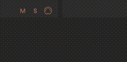
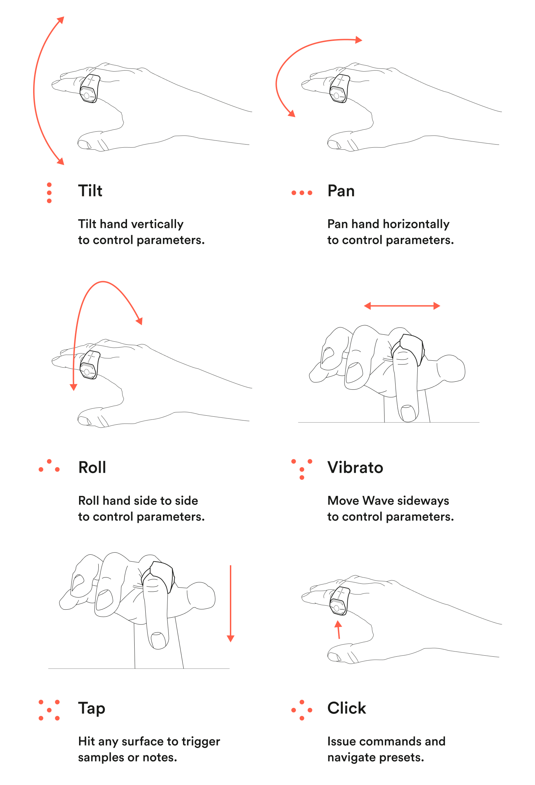

Wave has six functions that can be used individually or combined in any way you like. Each function has its own characteristics.

:::tip[Mapping Movements to your DAW]

In order to map functions from Softwave to your DAW, such as Ableton Live or Logic Pro, you need to attach a MIDI CC number to the function.

You can assign any CC number, but make sure each function has an individual number.
Softwave uses this number to communicate with your DAW.

Some DAWs such as Cubase and Pro Tools have some of their CC values hard coded, so you can't use all of them.

Additionally you can assign:

1. PB (Pitchbend) to Tilt, Pan, Roll and Vibrato.
2. Notes (C, C#, D, E, F etc.) when using the Tap function.
3. Notes and Key commands/Shortcuts (cmd+T, R, f12 etc.) when using the Click function.

:::

[**Tilt, Pan** and **Roll**](/wave-for-music/functions/tilt-pan-roll) allow you to control parameters in a new way.

[**Vibrato**](/wave-for-music/functions/vibrato) lets you add natural vibrato to your playing.

[**Tap**](/wave-for-music/functions/tap) lets you hit any surface to trigger notes or samples.

[**Click**](/wave-for-music/functions/click) lets you use the buttons on Wave to send MIDI or Key commands.
