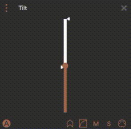

You can use two Waves within Softwave at a time - Wave **A** and **B** .

### Connecting a second Wave

To connect a second Wave to Softwave press **B** at the top left corner of Softwave.

Then follow the same steps as before when you connected the first Wave.

### Changing Wave **A** to **B** and vice versa

To change Wave **A** to **B** select Wave **A** and drag it down under **B**.

The two connected Waves should change roles.

### Mapping functions to B

Automatically all new functions you add to your preset are mapped to Wave **A**.

To map functions over to Wave **B** press the **A** in the lower left corner of the function window. It should turn from brown to white and read **B** instead of **A**.

Repeat for all functions you want to map over to **B**.

### Identifying which Wave is which

In the top left corner of Softwave press the name of the Wave you want to identify. The LED screen on that Wave will light up.
